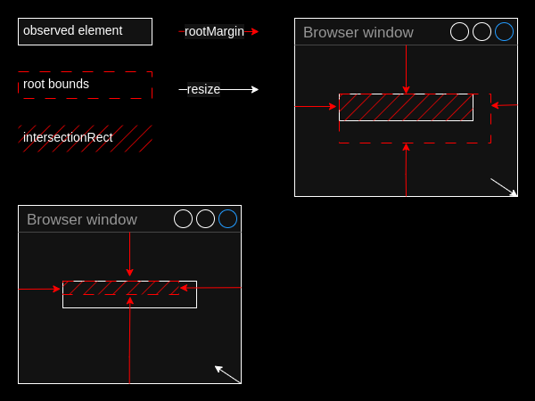
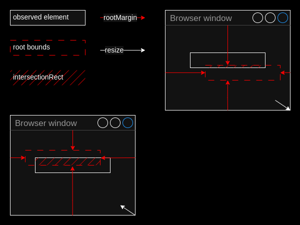

I recently needed a solution to observe DOM element's position change in order to adjust another element accordingly, which might be placed beside as well as above or below the observed element. I didn't manage to find a solution that would satisfy my needs, under any circumstances reliably detect any kind of position change caused by scroll, resize, layout change or zoom and at the same time wouldn't hang in the background constantly polling the element. Luckily, I came across the article: [Observing position-change of HTML elements using Intersection Observer](https://dev.to/ajk-essential/observing-position-change-of-html-elements-using-intersection-observer-12de). It describes a reliable method and gave me a good foundation to build up on.

As a result I implemented a hybrid approach that uses four `IntersectionObserver` instances to detect the beginning of element's bounding rectangle change in any direction, then runs a [`requestAnimationFrame` loop](https://www.npmjs.com/package/request-animation-frame-loop) as the element keeps moving. When element's bounds stop changing, it stops the loop and recreates the affected observers.

**See [Position observer](https://itihon.github.io/position-observer/) demo.**

In this article I want to describe some caveats discovered while experimenting with `IntersectionObserver`, when you shouldn't rely on `intersectionRect` and `visualViewport` size, and consider an alternative way when you can do without observing element's position change.

## What for?

A typical use case, as I mentioned above, is when you have two DOM elements placed inside different parent containers (or maybe they come from different component libraries, or you are not allowed to modify any of them), and you need to to stick them together so that if one of them (the observed one) changes the coordinates of its bounding rectangle, the other one moves along.

## Possible approaches

One of possible approaches is to crop the root's bounding box to the size of the observed element. This approach has several drawbacks.

When an observed element is partly overlapped by its scrollable parent container, it creates a situation in which `intersectionRatio` doesn't change when the element moves until it is fully visible, therefore position change can not be detected.


The solution may be to calculate `rootMargin` so that `rootBounds` rectangle is captured inside the overlapping container and never leaves its boundaries. When the observed element is fully scrolled out of view, we just "switch" the observer to full vewport size to detect when the element gets visible again, so when it happens, we "switch" back to the cropped size.


Another problem occurs when resizing browser window, since `rootMargin` set in pixels it is static, `rootBounds` rectangle shrinks and expands with the window, creating "blind areas" with `intersectionRatio = 1.0`.



The solution to this may be calculating `rootMargin` in percents relation of the element's left and top coordinates to viewport's width and hight respectively. Now `rootMargin` is dynamic, `rootBounds` rectangle has a fixed size, but this way it runs away from the element on window resize. Although it doesn't prevent position change from being detected, when both element and detector are able to move, it makes the whole solution slightly less predicatble and adds more edge cases to check.



An observed element itself can also change its size. This entails the same consequences as described above. This can be possibly solved by using two `IntersectionObservers` with the cropped `rootBounds` rectangle per element, inner and outer. One detects size decrease, the other one detects size increase. They both would be needed to be recreated after every resize or position change. Another solution to this problem may be to use `ResizeObserver` in combination with `IntersectionObserver`.

This already gets us closer to the 4-observers concept.

## 4 observers

Keeping in mind all edge cases of the approach with `rootBounds` rectangle cropped to the target element size, I realized it would be much easier to observe each side of the element's bounding box instead of an element as a whole. No matter in which direction an element moves, its position or size change will be relibly detected by at least one observer. For that an element must be at least partly visible.

The algorithm is simple: we create 4 observers whose `rootBounds` rectangles initially intersect each side of the observed element by 2 pixels. If an intersection deviates from the range between 1 and 2 pixels in any direction, position or size change is detected. Since the same change can be detected by more than one observer, we invoke the `.takeRecords()` method of the rest observers in order to gather pending records and prevent repetetive callback function calls. Then we mark those observers for recreation whose records we collected. In the worst case (diagonal movement) it would be all 4. Then we "unobserve" all 4 observers, start a [`requestAnimationFrame` loop](https://github.com/itihon/request-animation-frame-loop/) and keep it running until the element's bounding rectangle stops changing. Once it happens, we stop the loop, and recreate the marked observers.


This looks more straithforward and implies much less edge cases to handle. If position change happens in between observer creation and its first callback invokation, we just repeat the cycle as if it was actual position change detection but only if the target element is inside document's viewport boundaries. This is a protection against an infinite loop. Whereas in the "cropped observer" approach, due to its variaty of edge cases, I had to implement the mechanics to distinguish between the first call of a callback after the `IntersectionObserver().observe()` method invokation and an actual intersection change notification.

### Why not to consider resize and scroll event handlers?

Having to handle events in combination with `IntersectionObserver`, that is code with different kinds of asynchronous nature, that executes in different phases and with different frequencies makes it hard to debug and brittle.

Moreover, in event handlers observing position change implies `getBoundingClientRect()` invokations. Not only it may be expensive, data aquired in one phase of asynchronous execution may turn out already stale in other phase where it is consumed.

### When you shouldn't rely on `intersectionRect` and `intersectionRatio`

As I already mentioned this case above, when a target element can possibly be partly overlapped by its parent scrollable container. If this is the case, it is better to calculate intersection using `rootBounds` and `boundingClientRect` rectangles, because `intersectionRect` and `intersectionRatio` reflect intersection of a target's visible part rather than the whole target.

### When you shouldn't use `visualViewport` with `IntersectionObserver`

It may seem logical at first glance to use `visualViewport.height` or `window.innerHeight` in order to calculate the bottom margin of `rootMargin`. This will not be consistent among mobile and desktop screens if `minimum-scale=1.0` is not specified in the meta tag.

```html
<meta name="viewport" content="width=device-width, height=device-height, initial-scale=1.0, minimum-scale=1.0" />
```

Open developer tools, set the desktop view mode and put the spippet down below in the console. Then switch to the mobile view mode, refresh the page and paste the snippet again. See the difference.

```js
var obs = new IntersectionObserver(
  entries => {
    console.log(
      'rootBounds.height:',
      entries[0].rootBounds.height,
      'visualViewport.height:',
      window.visualViewport.height,
      'window.innerHeight:',
      window.innerHeight,
    );
  },
  { root: document },
);

const longDiv = document.createElement('div');
longDiv.style.width = `${20000}px`;
longDiv.style.height = `${10}px`;
longDiv.style.position = 'absolute';
document.body.appendChild(longDiv);

obs.observe(document.documentElement);
```

It seems the most reliable way is to use viewport dimensions of an already created instance of `IntersectionObserver` (since it already calculated them for itself) to calculate `rootMargin` for another instance. This way we are dealing with the same source of truth and the same units regardles of scaling.

```js
// initial viewport rect
const viewportRect = await new Promise(res => {
  const observer = new IntersectionObserver(
    entries => {
      res(entries[0].rootBounds);
      observer.unobserve(document.documentElement);
    },
    { root: document },
  );
  observer.observe(document.documentElement);
});

const { width: viewportWidth, height: viewportHeight } = viewportRect;
```

## Alternative approach (When you can do without an observer at all?)

I couldn't finish without mentioning this hacky approach. If you need to stick one element to another one (target element) without employing any kind of position change observation, you can wrap the element into an auxiliary container with width and height equal to 0, so that it doesn't interfere with the natural document flow. Put this zero-sized container into the target's parent container right next to the target element using:

```js
target.insertAdjacentElement('afterend', zeroSizedContainer);
```

Set the necessary offset for the element inside the zero-sized container and let the browser do the job.

Limitations for this approach:

- When the target's parent container has flexbox layout with set `gap` or `justify-content: space-between;` it will create gaps and spaces for that zero-sized container.
- And it will definetely break the target's parent container grid layout.

These limitations actually were the reason I started this project.
