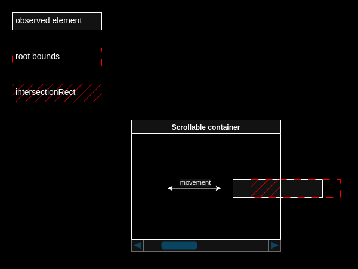
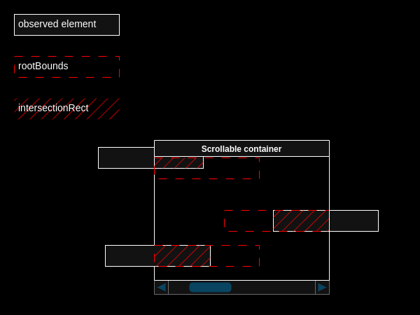
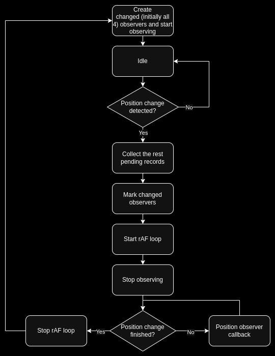

Это перевод моей статьи: [Detecting size and position change of a DOM element as a result of scroll, resize or zoom with IntersectionObserver.](https://dev.to/itihon/detecting-size-and-position-change-of-a-dom-element-as-a-result-of-scroll-resize-or-zoom-with-29ai)

Недавно мне понадобилось решение для наблюдения за изменением положения элемента DOM, чтобы соответствующим образом подстраивать другой элемент, который может быть размещен как рядом, так и выше или ниже наблюдаемого элемента. Мне не удалось найти готового решения, которое бы удовлетворяло моим потребностям: при любых обстоятельствах надежно обнаруживать любое изменение положения, вызванное прокруткой, изменением размера окна, родительского контейнера или самого целевого элемента, изменением разметки или масштабирования, и в то же время не висело бы в фоновом режиме, постоянно опрашивая целевой элемент. К счастью, я наткнулся на статью: [Observing position-change of HTML elements using Intersection Observer](https://dev.to/ajk-essential/observing-position-change-of-html-elements-using-intersection-observer-12de). Она описывает достаточно надежный метод и дала мне хорошую основу для дальнейшего развития.

В результате я реализовал гибридный подход, который использует четыре экземпляра `IntersectionObserver` для обнаружения начала изменения ограничивающего прямоугольника элемента в любом направлении, а затем запускает [`цикл requestAnimationFrame`](https://www.npmjs.com/package/request-animation-frame-loop) и "крутит" его по мере движения элемента. Когда границы элемента перестают меняться, цикл останавливается и заново пересоздаются затронутые экземпляры наблюдателей.

**См. [Position observer](https://itihon.github.io/position-observer/) демонстрация работы.**

В этой статье я хочу описать некоторые подводные камни, обнаруженные в ходе экспериментов с `IntersectionObserver`, когда не следует полагаться на размеры `intersectionRect` и `visualViewport`, а также рассмотреть альтернативный способ, когда можно обойтись и без наблюдения за изменением положения элемента.

## Зачем?

Типичный вариант использования, как я уже упоминал выше, — это когда у вас есть два элемента DOM, размещенные в разных родительских контейнерах (или, возможно, они взяты из разных библиотек компонентов, или вам не разрешено изменять ни один из них), и вам нужно "прикрутить" один к другому так, чтобы если один из них (наблюдаемый) изменил координаты своего ограничивающего прямоугольника, другой переместился бы в соответсвии с этими изминениями.

## Возможные подходы

Один из возможных подходов — "обрезать" прямоугольник наблюдателя до размеров наблюдаемого элемента, установив отрицательные значения `rootMargin`. Этот подход имеет несколько недостатков.

Когда наблюдаемый элемент частично перекрывается своим прокручиваемым родительским контейнером, создается ситуация, в которой `intersectionRatio` не изменяется при перемещении элемента до тех пор, пока он не станет полностью видимым, поэтому изменение положения невозможно обнаружить.



Решение может заключаться в вычислении `rootMargin` так, чтобы прямоугольник `rootBounds` был "захвачен" внутри перекрывающего контейнера и никогда не покидал его границ. Когда наблюдаемый элемент полностью скрывается из вида в результате прокрутки, мы просто «переключаем» наблюдателя на полный размер окна, чтобы определить, когда элемент снова станет видимым, и когда это происходит, мы «переключаемся» обратно на обрезанный размер.



Другая проблема возникает при изменении размера окна браузера. Если `rootMargin` задан в пикселях, прямоугольник `rootBounds` сжимается и расширяется вместе с окном, создавая «слепые зоны» с `intersectionRatio = 1.0`.


Решением этой проблемы может быть вычисление `rootMargin` в процентном отношении левой и верхней координат элемента к ширине и высоте области просмотра соответственно. Теперь `rootMargin` становится динамическим, прямоугольник `rootBounds` имеет фиксированный размер, но таким образом он убегает от элемента при изменении размера окна. Хотя это не мешает обнаружению изменения положения, когда и элемент, и детектор могут перемещаться, это делает все решение немного менее предсказуемым и увеличивает количество граничных случаев для проверки.


Наблюдаемый элемент сам по себе также может изменить свой размер. Это влечет за собой те же последствия, что описаны выше. Это можно решить, используя два экземпляра `IntersectionObserver` с обрезанным прямоугольником `rootBounds`, внутренний и внешний. Один обнаруживает уменьшение размера, другой обнаруживает увеличение размера. Их оба нужно будет создавать заново после каждого изменения размера или положения наблюдаемого элемента. Другим решением этой проблемы может быть использование `ResizeObserver` в сочетании с `IntersectionObserver`.

Это уже подводит нас ближе к концепции четырех наблюдателей.

## Четыре наблюдателя

Учитывая все пограничные случаи подхода с прямоугольником `rootBounds`, обрезанным до размера целевого элемента, я понял, что будет гораздо проще наблюдать за каждой стороной ограничивающего прямоугольника элемента, а не за всем элементом целиком. Независимо от того, в каком направлении движется элемент, его положение или изменение размера будут надежно обнаружены по крайней мере одним наблюдателем. Для этого элемент должен быть хотя бы частично видимым (т.е. не перекрытым полностью родительским контейнером).

Алгоритм прост: мы создаем 4 наблюдателя, прямоугольники `rootBounds` которых изначально пересекают каждую сторону наблюдаемого элемента на 2 пикселя. Если пересечение отклоняется от диапазона от 1 до 2 пикселей в любом направлении, детектируется изменение положения или размера. Поскольку одно и то же изменение может быть обнаружено более чем одним наблюдателем, мы вызываем метод `.takeRecords()` остальных наблюдателей, чтобы собрать ожидающие записи пересечений и предотвратить повторяющиеся выполнения функции обратного вызова. Затем мы помечаем для пересоздания тех наблюдателей, записи которых мы собрали. В худшем случае (движение по диагонали) это будут все 4. Затем мы «отключаем» всех 4 наблюдателей, запускаем [`цикл requestAnimationFrame`](https://github.com/itihon/request-animation-frame-loop/) и продолжаем его выполнение до тех пор, пока ограничивающий прямоугольник элемента не перестанет изменяться. Как только это произойдет, мы останавливаем цикл и пересоздаем отмеченных наблюдателей.



Это уже выглядит попроще и подразумевает гораздо меньше пограничных случаев для обработки. Если изменение положения происходит в промежутке между созданием наблюдателя и первым выполнением его функции обратного вызова, мы просто повторяем цикл, как если бы это было фактическое обнаружение изменения положения, но только если целевой элемент находится внутри границ области просмотра документа. Это защита от бесконечного цикла. В то время как в подходе «обрезанного наблюдателя» из-за разнообразия пограничных случаев мне пришлось реализовать механику для различения первого выполнения функции обратного вызова, который происходит при следующей перерисовке кадра после вызова метода `new IntersectionObserver().observe()` и фактического уведомления об изменении пересечения.

### Почему не рассмотреть обработчики событий "resize" и "scroll"?

Необходимость обработки событий в сочетании с `IntersectionObserver`, то есть код с различными видами асинхронной природы, который выполняется в разных фазах и с разной частотой, затрудняет отладку и делает код нестабильным.

Более того, в обработчиках событий наблюдение за изменением позиции подразумевает вызовы `getBoundingClientRect()`. Это может быть не только затратно, данные, полученные в одной фазе асинхронного выполнения, могут оказаться уже устаревшими в другой фазе, где они собственно и используются.

### Когда не следует полагаться на `intersectionRect` и `intersectionRatio`?

Как я уже упоминал выше, тот случай, когда целевой элемент может частично перекрываться его родительским прокручиваемым контейнером. Если это так, то лучше вычислять пересечение с помощью координат прямоугольников `rootBounds` и `boundingClientRect`, поскольку `intersectionRect` и `intersectionRatio` отражают пересечение лишь видимой части целевого элемента, а не всего элемента.

### Когда не следует использовать `visualViewport` вместе с `IntersectionObserver`?

На первый взгляд может показаться логичным использовать `visualViewport.height` или `window.innerHeight` для вычисления нижнего отступа `rootMargin`. Это не будет одинаково работать на мобильных и десктопных экранах, если `minimum-scale=1.0` не указано в метатеге.

```html
<meta name="viewport" content="width=device-width, height=device-height, initial-scale=1.0, minimum-scale=1.0" />
```

Откройте инструменты разработчика, установите десктопный режим просмотра и поместите сниппет ниже в консоль. Затем переключитесь в режим просмотра мобильного устройства, обновите страницу и снова вставьте сниппет. Посмотрите на разницу.

```js
var obs = new IntersectionObserver(
  entries => {
    console.log(
      'rootBounds.height:',
      entries[0].rootBounds.height,
      'visualViewport.height:',
      window.visualViewport.height,
      'window.innerHeight:',
      window.innerHeight,
    );
  },
  { root: document },
);

const longDiv = document.createElement('div');
longDiv.style.width = `${20000}px`;
longDiv.style.height = `${10}px`;
longDiv.style.position = 'absolute';
document.body.appendChild(longDiv);

obs.observe(document.documentElement);
```

Кажется, наиболее надежным способом определения размеров области просмотра будет использование уже созданного экземпляра `IntersectionObserver` (поскольку "он уже рассчитал" их для себя) для вычисления `rootMargin` для другого экземпляра. Таким образом, мы имеем дело с тем же источником истины и теми же единицами независимо от масштабирования.

```js
// initial viewport rect
const viewportRect = await new Promise(res => {
  const observer = new IntersectionObserver(
    entries => {
      res(entries[0].rootBounds);
      observer.unobserve(document.documentElement);
    },
    { root: document },
  );
  observer.observe(document.documentElement);
});

const { width: viewportWidth, height: viewportHeight } = viewportRect;
```

## Альтернативный подход (Когда можно обойтись и вовсе без наблюдателя?)

Я не мог закончить, не упомянув этот заковыристый подход. Если вам нужно прикрутить один элемент к другому (целевому элементу) без использования какого-либо наблюдения за изменением положения, вы можете обернуть элемент во вспомогательный контейнер с шириной и высотой, равными 0, чтобы он не мешал естественному потоку документа. Поместите этот контейнер нулевого размера в родительский контейнер целевого элемента, прямо рядом с целевым элементом, используя:

```js
target.insertAdjacentElement('afterend', zeroSizedContainer);
```
Установите необходимое смещение для элемента внутри контейнера нулевого размера и позвольте браузеру делать свое дело.

Ограничения для этого подхода:

- Если родительский контейнер целевого элемента имеет `flexbox` разметку с установленным `gap` или `justify-content: space-between;`, это создаст зазоры и пробелы для этого контейнера нулевого размера.
- И это точно поломает `grid` разметку родительского контейнера.

Эти ограничения собственно и послужили причиной того, что я начал этот небольшой проект.
