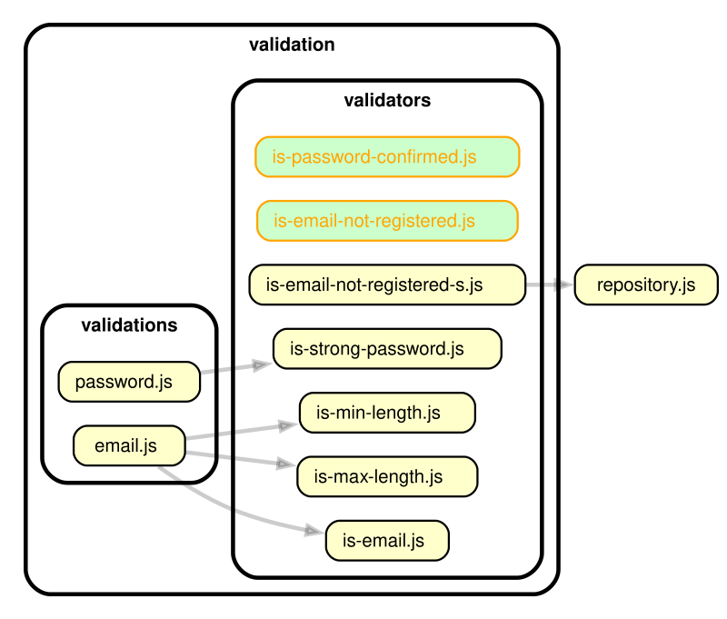
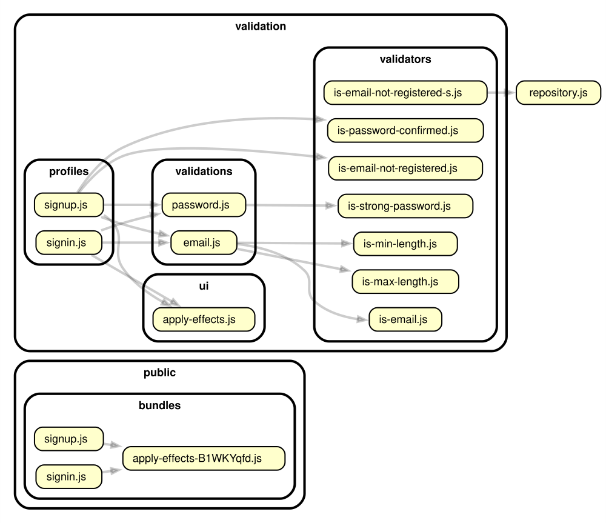
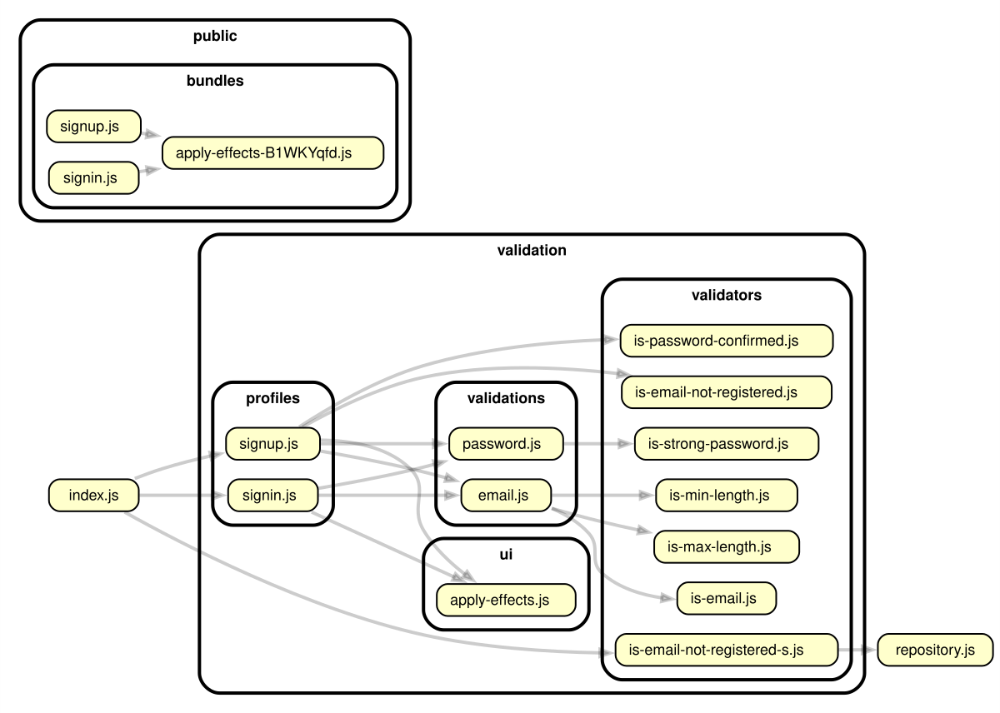

In this post I want to briefly describe the usage of **Isomorphic-validation**, a [javascript validation library](https://itihon.github.io/isomorphic-validation/) that was intended to be used on the client and server side and make the process of validating user input seamless across your application.

In the two previous posts I covered some aspects of using this library on the client side by creating a sign-in and sign-up form:

 - [Part 1](https://dev.to/itihon/quick-introduction-to-isomorphic-validation-javascript-library-48p6)
 - [Part 2](https://dev.to/itihon/handling-asynchronous-validators-and-mutually-dependent-fields-using-isomorphic-validation-library-n96)

 Here I will show why this library is actually isomorphic. I'm going to incorporate that sign-in and sign-up examples into a simple `Node.js` application.

 If you want to run this project locally it is here:

 
 View on Github 
 

## 0. Setting up the project

First, I created the following folder structure:

```bash
.
⊟── public
│   ⊞─── bundles
│   ├── signin.html
│   ├── signup.html
│   └── style.css
├── repository.js
⊟─── validation
    ⊞── profiles
    ⊞── ui
    ⊞── validations
    ⊞── validators
```


```js
// repository.js
```



```html
<!-- public/signin.html -->
```



```html
<!-- public/signup.html -->
```



```scss
// public/style.css
```


I didn't want to set up the whole database for this simple demonstration, so I just created a mock repository file with registerd e-mail addresses in order to implement the checking an e-mail for existance functionality.

## 1. Preparing validators

```bash
.
⊞─── public
├── repository.js
⊟─── validation
    ⊞── profiles
    ⊞── ui
    ⊞── validations
    ⊟── validators
        ├── is-email.js
        ├── is-email-not-registered.js
        ├── is-email-not-registered-s.js
        ├── is-max-length.js
        ├── is-min-length.js
        ├── is-password-confirmed.js
        └── is-strong-password.js
```


```js
// validation/validators/is-email.js
```



```js
// validation/validators/is-email-not-registered.js
```



```js
// validation/validators/is-email-not-registered-s.js
```



```js
// validation/validators/is-max-length.js
```



```js
// validation/validators/is-min-length.js
```



```js
// validation/validators/is-password-confirmed.js
```



```js
// validation/validators/is-strong-password.js
```


## 2. Preparing validations

```bash
.
⊞─── public
├── repository.js
⊟─── validation
    ⊞── profiles
    ⊞── ui
    ⊟── validations
    │   ├── email.js
    │   └── password.js
    ⊞─── validators
```


```js
// validation/validations/email.js
```



```js
// validation/validations/password.js
```




## 3. Creating UI effects

```bash
.
⊞─── public
├── repository.js
⊟─── validation
    ⊞── profiles
    ⊟── ui
    │   └── apply-effects.js
    ⊞── validations
    ⊞── validators
```


```js
// validation/ui/apply-effects.js
```


## 4. Creating validation profiles

```bash
.
⊟── public
├── repository.js
⊟── validation
    ⊟── profiles
    │   ├── signin.js
    │   └── signup.js
    ⊞─── ui
    ⊞─── validations
    ⊞─── validators
```


```js
// validation/profiles/signin.js
```



```js
// validation/profiles/signup.js
```




## 5. Creating the server

```bash
.
├── index.js
⊞─── public
├── repository.js
⊟── validation
    ⊞─── profiles
    ⊞─── ui
    ⊞─── validations
    ⊞─── validators
```


```js
// index.js
```


## Final result

```bash
.
├── index.js
⊟── public
│   ⊞─── bundles
│   ├── signin.html
│   ├── signup.html
│   └── style.css
├── repository.js
⊟── validation
    ⊟── profiles
    │   ├── signin.js
    │   └── signup.js
    ⊟── ui
    │   └── apply-effects.js
    ⊟── validations
    │   ├── email.js
    │   └── password.js
    ⊟── validators
        ├── is-email.js
        ├── is-email-not-registered.js
        ├── is-email-not-registered-s.js
        ├── is-max-length.js
        ├── is-min-length.js
        ├── is-password-confirmed.js
        └── is-strong-password.js
```



## Conclusion