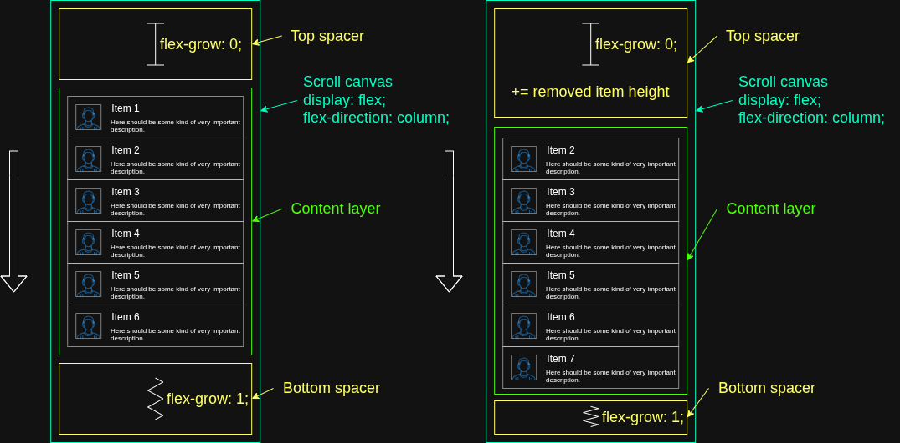
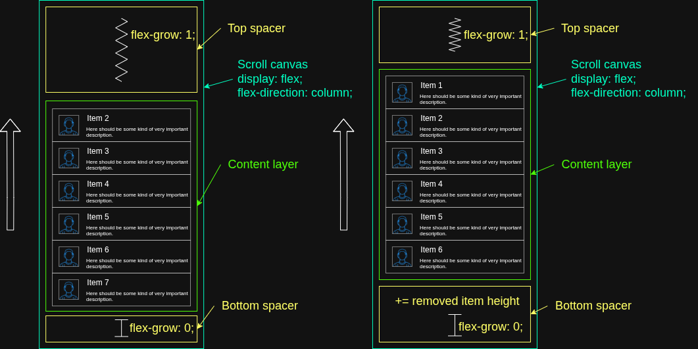
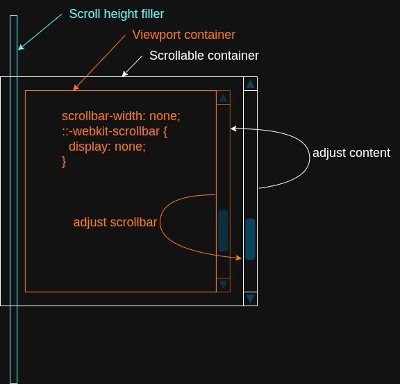
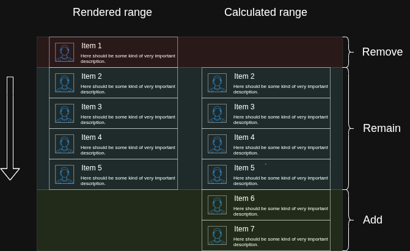
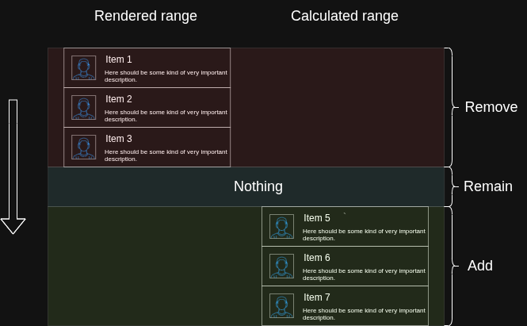
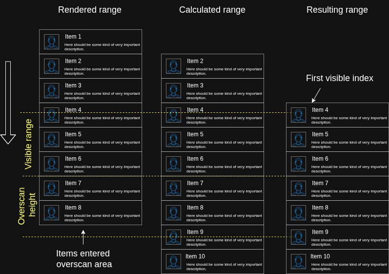
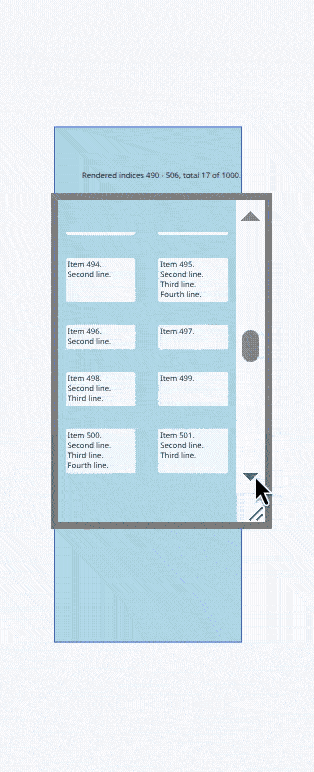

In this article I'd like to share my approach to virtualizing lists with items of unknown height. Most existing virtualization libraries solve this problem by estimating item sizes, measuring the rendered elements, and continuously correcting those estimates as more information becomes available.

Here I'd like to describe a method that takes a different approach. Instead of relying on accumulated item offsets, it maps item indices directly to the scrollbar position. This makes it possible to determine the visible range with good accuracy without knowing — even approximately — the sizes of all preceding items, using only simple math and the browser's native layout and positioning mechanics.

Live demos in TypeScript, React, Vue, and Angular are available at the [Layout Virtual homepage](https://itihon.github.io/layout-virtual/).
 
Source code: [github.com/itihon/layout-virtual](https://github.com/itihon/layout-virtual)

## The Traditional Approach

Let's start with the simplest case — a list where every item has the same **fixed height**. To find the start of the visible range, divide `scrollTop` by item height — that gives you the number of scrolled-past items (the start index). Likewise, determining how many items are needed to fill the viewport is straightforward: divide the viewport height by the item height.

Things become slightly more complicated when item **heights are different** but known in advance. In this case, the list must first be traversed to build an array of cumulative offsets (the prefix sums of all preceding item heights), an `O(N)` operation. Once this preprocessing is complete, the visible range can be quickly found during scrolling in `O(log N)` time using binary search. The initial preprocessing can be optimized by spreading the work across multiple animation frames to avoid blocking the UI. Another common optimization is lazy evaluation — only computing offsets up to where the user has actually scrolled.

It gets even more interesting when the items have completely unknown, **dynamic heights** — items whose height depends on content, and which can change when the viewport resizes and text reflows. If the previous method relied on known heights to calculate offsets, what do we do when those heights are unknown? The common workaround is to pick an "estimated" height, and then, as the user scrolls, measure the actual sizes of the rendered elements (for example, using `ResizeObserver`), and continuously correct the accumulated offsets as scrolling progresses.

What if we could sidestep all of that?

## The Core Idea

Instead of anchoring the visible range to absolute item heights (which are unknown), we can **anchor item indices to scroll percentage**.

Imagine a list of 110 items, viewport height 100px, each item 10px tall. In this example:

- when the scrollbar is at 0%, item 0 is at the top of the viewport;
- at 25%, item 25 is at the top;
- at 50%, item 50 is at the top;
- at 75%, item 75 is at the top;
- and finally, at 100%, item 100 reaches the top of the viewport.

For the sake of clarity, I've deliberately picked dimensions and quantity here so that the scroll percentage perfectly maps to the index of the first visible element.


Here is a [link to the example](https://v49.livecodes.io/?x=id/8j6kgdwbdvk) to make it easier to visualize.

From this example, we can derive the following relationship:

```
viewportTopIndex / (itemsCount - viewportItemCount) = scrollTop / (scrollHeight - clientHeight)
```

> The first visible index relates to the total number of scrollable items the same way scroll position relates to the total scroll range.

But in a dynamic list, how can we possibly know how many elements (`viewportItemCount`) will fit into the viewport?

## Anchor Points

Suppose there exists an item whose index corresponds to the current scrollbar position. This item doesn't necessarily have to be the first visible one — it can be anywhere inside the visible range. If we remove the unknown terms from the previous equation, we are left with a direct ratio: an item's index relative to the total item count equals the current scroll percentage:

```
index / itemsCount = scrollTop / (scrollHeight - clientHeight)
```

This specific index, which resides somewhere within the visible range, will serve as our **anchor**. Its physical position inside the viewport is determined by the **viewport's anchor point**, calculated by multiplying the scroll percentage (the right side of the formula above) by the viewport height:

```
viewportAnchor = scrollTop / (scrollHeight - clientHeight) * clientHeight
```

As the scrollbar moves toward the top, the anchor point approaches the top of the viewport. As it moves toward the bottom, the anchor point shifts toward the bottom. At 50%, the anchor point is exactly in the middle of the viewport.

Now, to determine the precise position of this anchor element within the visible area, let's derive the index from our formula:

```
anchorIndex = scrollTop / (scrollHeight - clientHeight) * itemsCount
```

Using our previous 110-item example, let's calculate the anchor index at a 25% scroll position:

```
0.25 * 110 = 27.5 (where 27 is the index, and 0.5 represents 50% of the element's height)
```

The fractional remainder (0.5) in this result tells us the exact percentage of its own height that this element must be shifted above the viewport's anchor point. 

> In other words, at 25% scroll position, the element with index 27 will sit exactly half its height above the anchor point — which itself is positioned 25% of the viewport height below the top edge of the viewport.

If we change the total item count in our example from 110 to exactly 100, the elements that used to be the first visible items now become the anchors themselves. Meaning:

- 0% scroll - index 0
- 25% scroll - index 25
- 50% scroll - index 50
- ...and so on.

---

**Essentially, this anchor element's height is the only height that needs to be measured in real time to determine the position of all visible elements. There's no need to know the absolute or even approximate sizes of all the other elements. Consequently, there is no need to maintain cumulative offset arrays, perform binary searches, or deal with complex range tree data structures.**

**The entire task boils down to rendering a range of elements that includes the anchor item, and then positioning that entire range so that the anchor aligns  with the viewport's current anchor point. In other words, we keep the scrollbar and the indices synchronized so that left and right sides of our first formula remain  equal. If this ratio is maintained, the physical scrollbar and the virtual elements will always converge at the beginning and the end of the list regardless of the actual heights of the elements.**

---

To achieve this, we need to decouple the scrollbar from the scroll canvas so that the elements move natively along with the canvas while the scrollbar independently reflects the progression of item indices.

There's one more challenge. Responsive Grid layout implies rendering elements in normal document flow — without wrappers, transformations (`transform: translate(...)`), or absolute positioning. This means adding or removing elements at the top of the visible range will cause a layout shift that pushes the rest of the content around, which we must compensate for. While it is easy to calculate this shift when scrolling down (since the heights of the elements being removed from the top are already known), how do we handle adding elements of completely unknown heights to the top when a user scrolls up?

## Container Anatomy

To solve this layout shift, we can imploy native Flexbox mechanics — specifically, the `flex-grow` property. We will align our content using two layout spacers (placeholders) at the top and bottom. One spacer maintains a fixed height, while the second one stretches to fill all remaining empty space, acting like a "spring" pushing the content against a rigid "stopper."

When scrolling down and unmounting elements from the top, we compensate for the upward content shift by expanding the height of the top "stopper" by the exact height of the removed elements. Meanwhile, as new elements mount at the bottom, the bottom "spring" naturally compresses by the correct amount.



When scrolling back up, we simply swap the roles of the two spacers: the bottom one becomes the rigid "stopper," and the top one turns into the dynamic "spring". Now, we don't have to worry about adding elements of unknown heights to the top; the browser's native layout engine takes care of it for us.



To decouple the scrollbar from the scroll canvas, we use two scrollable containers nested inside one another, making sure to hide the scrollbar of the inner container which serves as the viewport.



When a scroll event originates from the inner container (the viewport), we render the calculated range of items and adjust the outer container's scrollbar to align with the anchor element's position. It’s worth noting that if the anchor hasn't reached its target anchor point yet, we simply increment (or decrement, depending on the direction) the outer scrollbar position by 1px and wait for it to catch up. This step is likely the primary source of minor layout variance. Conversely, when the scroll event comes from the outer container, we render the corresponding item range and adjust the inner container's canvas position to guide the anchor element exactly where it belongs.

The virtual scroll height is estimated using the average of the known smallest and largest item heights:

```
scrollHeightFillerSize = (minItemHeight + maxItemHeight) / 2 * itemsCount
```

## Rendering

Since the sizes of newly inserted items are unknown, the viewport is filled based on the minimum known item height to guarantee that enough items are rendered to cover the visible area.

Rendering itself is based on the difference between two ranges: the currently rendered range and the newly calculated range. The update algorithm is straightforward:

- items that exist only in the rendered range are removed;
- items that belong to both ranges remain untouched;
- items that exist only in the calculated range are inserted.



If the two ranges do not intersect — for example, after a fast scroll — the current range is discarded completely and the new one is rendered from scratch.



However, this introduces another problem. Since we render elements based on a known minimal height, how do we avoid rendering far more elements than necessary?

To prevent excessive rendering, the calculated range is constrained on both sides:

- on one side by the minimum (or maximum, depending on the scroll direction) visible index;
- on the other by an overscan buffer (`overscanHeight`) in the direction of scrolling.

As a result, the rendered content is always shifted slightly ahead of the user's movement.

As long as the rendered content extends beyond the overscan area, no additional elements need to be rendered. In other words, we "wait" until the elements enter the overscan area during further scrolling before adding a new portion from the calculated range. While slightly more nodes than strictly necessary might temporarily reside in the DOM, further excessive rendering is kept in check by this natural boundary.



The resulting behavior of the rendered range boundaries looks like this:



## CSS Grid Support

To make this entire approach work seamlessly with a multi-column grid, we only need to introduce one additional parameter into our equations: the column count, which can be obtained directly from the computed styles:

```js
columnsCount = getComputedStyle(contentLayer).gridTemplateColumns.split(' ').length
```
Derive row count:

```js
rowsCount = Math.ceil(itemsCount / columnsCount)
```

Now, in our first formula, the anchor index no longer relates to the absolute item count, but rather the row count:

```
index / rowsCount = scrollTop / (scrollHeight - clientHeight)
```

In other words, the anchor is no longer an individual item — it becomes a row. Supporting the native CSS Grid layout simply means shifting our math from item indices to row indices. The rest of the algorithm is identical.

One extra constraint: to prevent items from jumping between rows as the rendered range changes, items must always be inserted and removed in groups whose size is a multiple of the number of columns.

## Conclusion

The idea came from asking: what if we avoided computing absolute offsets entirely and looked at the problem from a different angle? At any given moment we only see a slice of the list — so why compute the invisible parts? The goal isn't to position virtual items exactly where they'd be in a fully-rendered real container. The goal is to create the **visual impression** that rendered content matches the scrollbar position. By visualizing this as two distinct scales — a linear scale representing scroll percentages and a non-linear scale representing item indices of arbitrary heights — the challenge simply became finding a reliable way to map them together.

The result is an algorithm that is lightweight, predictable, and naturally resilient to dynamic content and responsive CSS Grid layouts. Instead of maintaining accumulated offsets for every item, it keeps the scrollbar synchronized with a single anchor item and lets the browser's layout engine do what it already does best.

Like any virtualization strategy, this approach has its own trade-offs and isn't intended as a universal replacement for existing techniques. But I think it simplifies virtualization for dynamic lists and responsive grids.

---
 
You can try the live demos (scroll, resize, watch the algorithm in action) with React, Vue, Angular, and vanilla TypeScript at the **[Layout Virtual homepage](https://itihon.github.io/layout-virtual/)**.
 
If the idea resonates, check out the [repository](https://github.com/itihon/layout-virtual) — stars, feedback in the comments, and pull requests are all very welcome!


