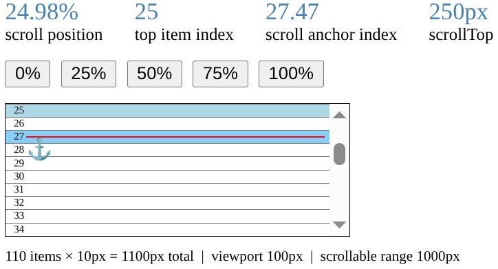

In this article I'd like to share a different approach to virtualizing lists with items of unknown height. Most existing virtualization libraries solve this problem by estimating item sizes, measuring the rendered elements, and continuously correcting those estimates as more information becomes available.

The method described here takes a different approach. Instead of relying on accumulated item offsets, it maps item indices directly to the scrollbar position. This makes it possible to determine the visible range with good accuracy without knowing — even approximately — the sizes of all preceding items, using only simple math and the browser's native layout and positioning mechanics.

Live demos in TypeScript, React, Vue, and Angular are available at the [Layout Virtual homepage](https://itihon.github.io/layout-virtual/).
 
Source code: [github.com/itihon/layout-virtual](https://github.com/itihon/layout-virtual)

## The Traditional Approach

Let's start with the simplest case — a list where every item has the same **fixed height**. To find the start of the visible range, divide `scrollTop` by item height — that gives you the number of scrolled-past items (the start index). Likewise, determining how many items are needed to fill the viewport is straightforward: divide the viewport height by the item height.

Things become slightly more complicated when item **heights are different** but known in advance. In this case, the list must first be traversed to build an array of cumulative offsets (the prefix sums of all preceding item heights), an `O(N)` operation. Once this preprocessing is complete, the visible range can be quickly found during scrolling in `O(log N)` time using binary search. The initial preprocessing can be optimized by spreading the work across multiple animation frames to avoid blocking the UI. Another common optimization is lazy evaluation — only computing offsets up to where the user has actually scrolled.

It gets even more interesting when the items have completely unknown, **dynamic heights** — items whose height depends on content, and which can change when the viewport resizes and text reflows. If the previous method relied on known heights to calculate offsets, what do we do when those heights are unknown? The common workaround is to pick an "estimated" height, and then, as the user scrolls, measure the actual sizes of the rendered elements (for example, using `ResizeObserver`), and continuously correct the accumulated offsets as scrolling progresses.

What if we could sidestep all of that?

## The Core Idea

Instead of anchoring the visible range to absolute item heights (which are unknown), we can **anchor item indices to scroll percentage**.

Imagine a list of 110 items, viewport height 100px, each item 10px tall. In this example:

- when the scrollbar is at 0%, item 0 is at the top of the viewport;
- at 25%, item 25 is at the top;
- at 50%, item 50 is at the top;
- at 75%, item 75 is at the top;
- and finally, at 100%, item 100 reaches the top of the viewport.

For the sake of clarity, I've deliberately picked dimensions and quantity here so that the scroll percentage perfectly maps to the index of the first visible element.



Here is a [link to the example](https://v49.livecodes.io/?x=id/8j6kgdwbdvk) to make it easier to visualize.

From this example, we can derive the following relationship:

```
viewportTopIndex / (itemsCount - viewportItemCount) = scrollTop / (scrollHeight - clientHeight)
```

> **The first visible index relates to the total number of scrollable items the same way scroll position relates to the total scroll range.**

But in a dynamic list, how can we possibly know how many elements (`viewportItemCount`) will fit into the viewport?

## Anchor Points

Suppose there exists an item whose index corresponds to the current scrollbar position. This item doesn't have to be the first visible one — it can be anywhere inside the visible range.